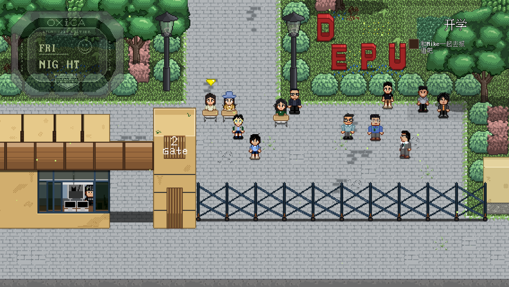
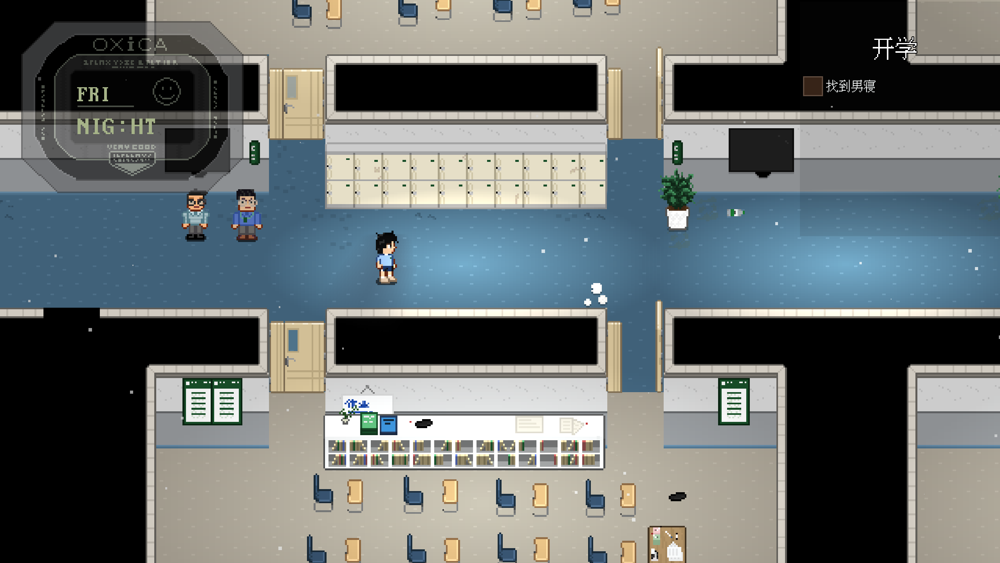
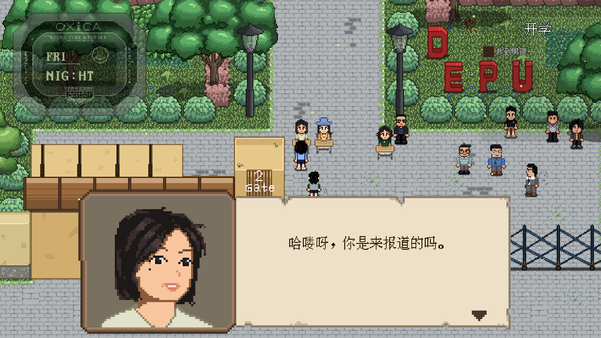
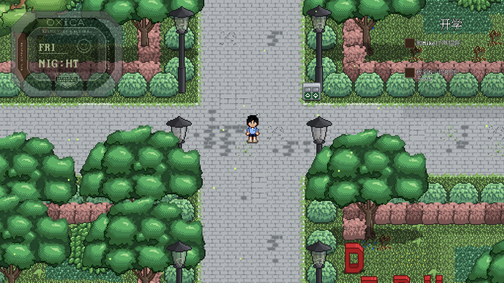

# Chinese International High School JRPG

A Persona-inspired pixel RPG set in a Chinese international high school, built with Godot 4.

Started in November 2025 by Alvin,
a first-year Aerospace Engineering student at
The University of Manchester.
This is my first long-term game development project.
The goal is to create a story-driven RPG that captures the atmosphere of Chinese high school life.
## Features

- Quest System
  - Main quests and sub quests
  - Multi-stage objectives
  - Quest tracking UI
  - NPC quest markers
  

- Dialogue System
  - Choice-based dialogue
  - Player naming
  - Multi-character conversations
  - Portrait and emotion system

- Inventory System
  - Item pickup
  - Stackable items
  - Different bag categories

- Time System
  - Weekday progression
  - Morning / Lunch / Dinner / Night cycle

- World State System
  - NPC visibility control
  - NPC movement and following
  - Persistent scene states
## Screenshots

## Campus Entrance

## Teaching Building

## Dialogue System

## Forecast

