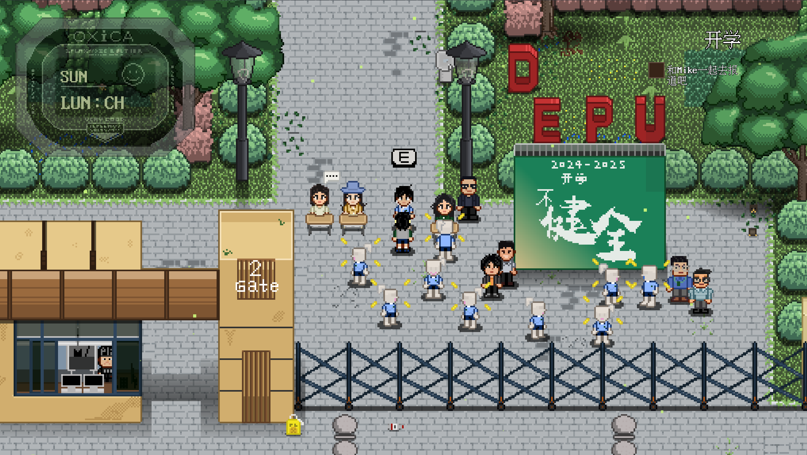
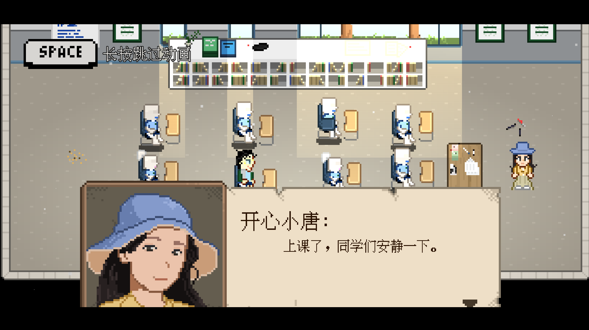
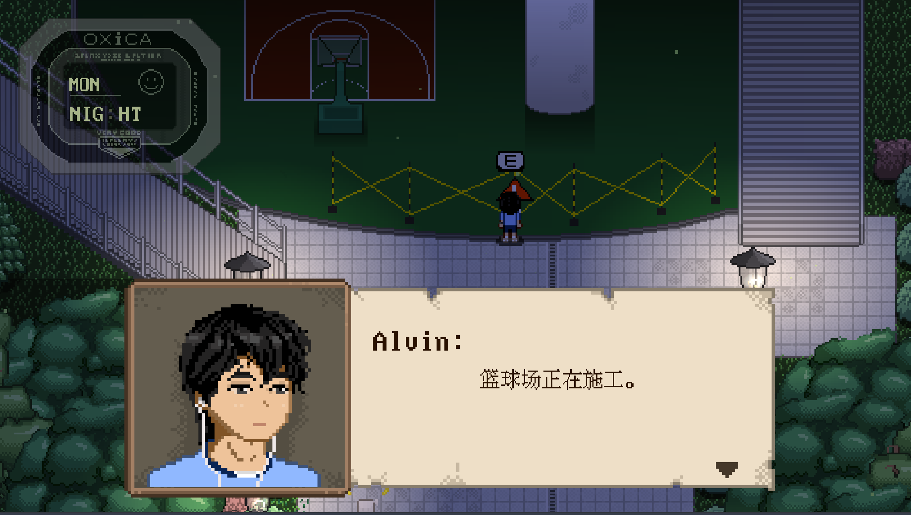
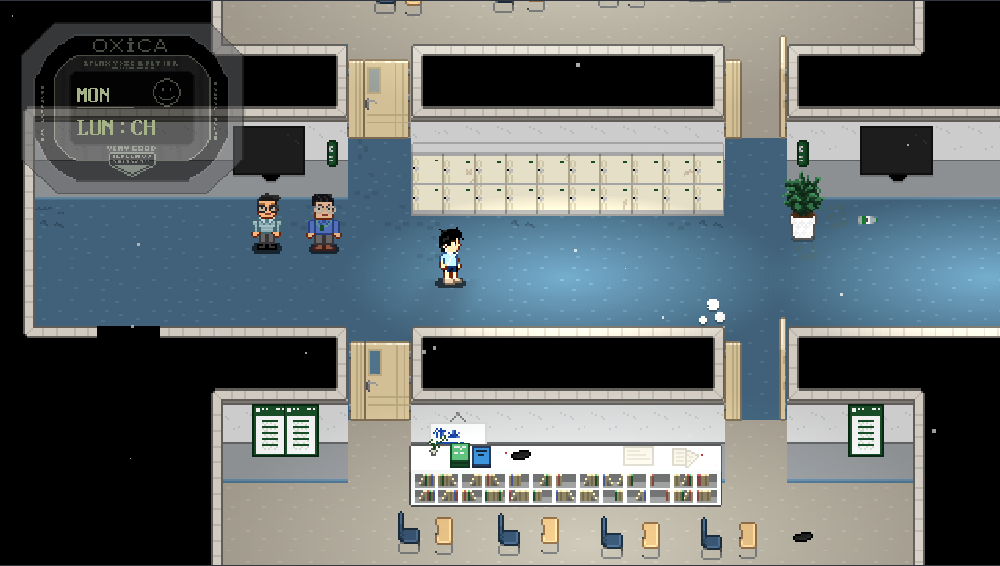
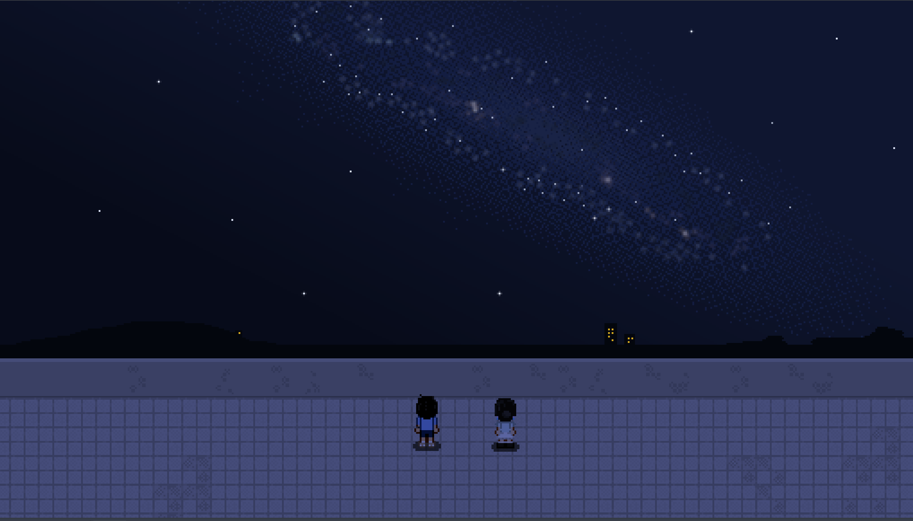

# Chinese International High School JRPG

A story-driven 2D pixel RPG set in a Chinese international high school, developed independently in **Godot 4** using **GDScript**.

Inspired by narrative RPGs such as *Persona*, the project focuses on combining everyday school life with branching dialogue, quests, NPC routines and a world that changes with time and story progression.

The project is currently in active development.

---

## Screenshots

### Campus & Quest System



### Dialogue System



### Time & World State



### Teaching Building



### Visual Atmosphere



---

## Core Systems

### Quest System

- Main and side quests with multiple progression states
- Multi-stage objectives and event-based progression
- Quest tracking UI and NPC quest markers
- Time-dependent quest conditions
- Quest progression can trigger dialogue, events and changes to the game world

Quest states are stored separately from gameplay logic and progress through states such as locked, unlocked, active and finished.

### Dialogue System

- Branching dialogue with player choices
- Multi-character conversations
- Player naming and character-name discovery
- Character portraits and emotion states
- Dialogue selected dynamically according to quest state and in-game time

NPC dialogue is loaded from external data and resolved against the current quest state rather than being hard-coded directly into individual NPC scripts.

### NPC System

- Reusable NPC base classes
- NPC schedules based on in-game day and time
- Quest-dependent NPC behaviour
- NPC following and classroom behaviour
- Reusable finite state machine for NPC behaviour

The NPC state machine currently supports behaviours including idle, following, background idle and in-class states, with shared `enter`, `update` and `exit` logic.

### Time & Daily Routine System

- Weekday and weekend progression
- Morning, lunch, dinner and night periods
- Different daily routines for school days and weekends
- Time-dependent quests, dialogue and NPC schedules
- Environment lighting changes according to the current time period

### World State System

- Quest progression can modify NPCs, objects and scene behaviour
- Persistent scene changes are recorded and reapplied
- NPC visibility, position and behaviour can change dynamically
- Default object schedules are applied according to day and time

The world-state controller listens for quest, time and scene events and refreshes the current scene accordingly.

### Inventory System

- Item pickup
- Stackable items
- Multiple inventory categories
- Inventory UI and item descriptions

---

## Technical Design

The project is built around several independent managers and reusable gameplay systems rather than placing all gameplay logic inside individual scenes.

Key technical ideas include:

- **Data-driven design** — quest, dialogue, world-state and schedule data are stored externally
- **Event-driven communication** — Godot signals are used to communicate between quests, UI, time, scenes and world-state systems
- **Finite state machines** — NPC behaviour is separated into reusable states
- **Reusable NPC architecture** — NPC data, dialogue and behaviour are separated from individual scene instances
- **Quest-driven world state** — story progression can modify dialogue, NPC behaviour, objects and accessible areas
- **Data validation** — quest JSON is checked for required fields, valid quest types, state structure and time-condition values before use

---

## System Overview

```text
                    Time Manager
                         |
                         v
                   NPC Schedules
                         |
                         v
Quest Data ---> Quest Manager ---> Event Bus
                    |                |
                    |                +------> UI
                    |                |
                    v                +------> NPC Behaviour
              World State
                    |
          +---------+---------+
          |                   |
          v                   v
      Scene State          Events
          |
          v
   NPCs / Objects / Areas
```

```text
Quest Progress
      |
      v
NPC Dialog Resolver <---- Time Conditions
      |
      v
Dialogue Data (JSON)
      |
      v
Dialogue UI
```

---

## Tech Stack

- **Engine:** Godot 4
- **Language:** GDScript
- **Data:** JSON
- **Version Control:** Git / GitHub
- **Art:** Original and custom pixel-art assets

---

## Project Structure

### Core Managers

- QuestManager
- TimeManager
- DailyRoutineManager
- WorldStateController
- SceneManager
- EventBus

### Quest & Dialogue

- QuestProgressStore
- QuestConditionChecker
- NPCDialogResolver
- Dialogue System

### NPC Behaviour

- NPCStateMachine
- Reusable NPC base classes

### Other Systems

- Inventory System

---

## Current Development

- Expanding story and quest content
- Reworking the inventory system
- Building a save and load system
- Improving reusable systems and code structure

---

## About the Project

This is an independent long-term project developed alongside my Aerospace Engineering studies at the University of Manchester.

The project began as an experiment in building a small narrative RPG and has gradually developed into a larger exercise in game-system architecture, data-driven design and state management.
